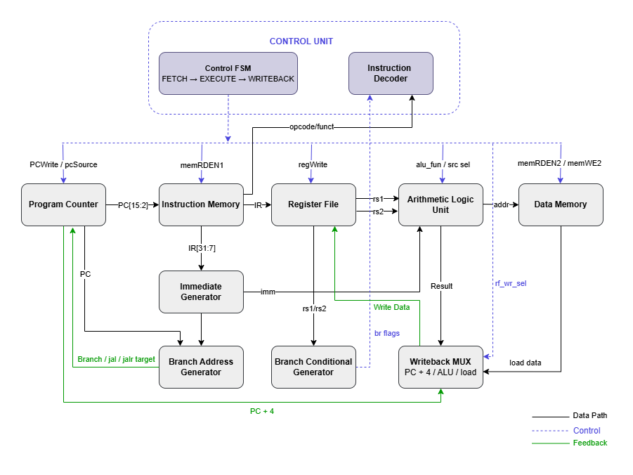

# OTTER RISC-V MCU

A 32-bit RV32I RISC-V processor implemented in SystemVerilog and deployed on a Digilent Basys3 FPGA board. This project was completed as part of CPE 233 (Computer Design and Assembly Language Programming) and focuses on CPU datapath design, control logic, and hardware verification.

## Overview

The processor implements the RV32I instruction set using a modular datapath architecture consisting of a program counter, register file, ALU, immediate generator, branch address generation, branch condition generation, and an FSM-based control unit. The design was integrated, simulated, and tested using custom SystemVerilog modules and testbenches before deployment to FPGA hardware.

## Architecture
The diagram below illustrates the processor datapath, control unit, branch execution logic, writeback path, and dual-port memory interface.

The processor datapath includes:

* Program Counter (PC)
* Register File
* Arithmetic Logic Unit (ALU)
* Immediate Generator
* Branch Address Generator
* Branch Condition Generator
* Control Unit Decoder
* Control Unit Finite State Machine (FSM)
* Dual-Port Memory Interface
* Memory-Mapped I/O Interface

## Implemented Components

The following modules were designed and implemented as part of this project:

| Module        | Description                                      |
| ------------- | ------------------------------------------------ |
| PCM           | Program counter management and update logic      |
| ALU           | Arithmetic and logical operations                |
| REG_FILE      | Register file implementation                     |
| IMMED_GEN     | RISC-V immediate value generation                |
| BranchAddrGen | Branch and jump target calculation               |
| BranchCondGen | Branch comparison logic                          |
| cu_dcdr       | Instruction decode and control signal generation |
| cu_fsm        | Finite-state machine controller                  |
| OTTERMCU      | Top-level processor integration                  |
| OTTERMCU_tb   | Functional verification testbench                |
| BCD           | Binary-coded decimal conversion logic            |

## Provided Infrastructure

The following files were provided as course infrastructure and integrated into the final design:

* otter_memory
* CathodeDriver
* SevSegDisp
* OTTER_Wrapper_v1_02
* Basys3_Master.xdc

## Supported Functionality

The processor supports key RISC-V datapath operations including:

* RV32I arithmetic and logical instructions
* Register-register and immediate operations
* Conditional branch instructions
* JAL and JALR control-flow operations
* Load and store instructions
* Memory-mapped I/O access

## Verification

Processor functionality was verified through simulation using a dedicated SystemVerilog testbench.

Verification included:

* ALU operation testing
* Register writeback verification
* Branch execution validation
* Control signal generation checks
* Datapath integration testing

## FPGA Deployment

The design was synthesized and deployed on a Digilent Basys3 FPGA development board. Functionality was validated using both provided OTTER memory images and custom test programs executed directly on hardware.

Demonstrated features include:

* Program execution
* Memory-mapped I/O
* Seven-segment display output
* User interaction through FPGA peripherals

## Contributors

This project was completed as a two-person team project for CPE 233.
- Eric Liu
- Joseph Dotado

## My Contributions

As part of a two-person team, I implemented and integrated major components of the OTTER RV32I processor in SystemVerilog, including the ALU, register file, program counter logic, immediate generator, instruction decoder, top-level processor integration, and verification testbench.

I was responsible for system integration, debugging, simulation-based verification, FPGA deployment, and hardware validation on a Digilent Basys3 board. I also developed custom memory files to test instruction execution and control flow on hardware.

Additional processor modules, including branch execution and control logic, were developed independently by both team members, with selected implementations integrated into the final design.

